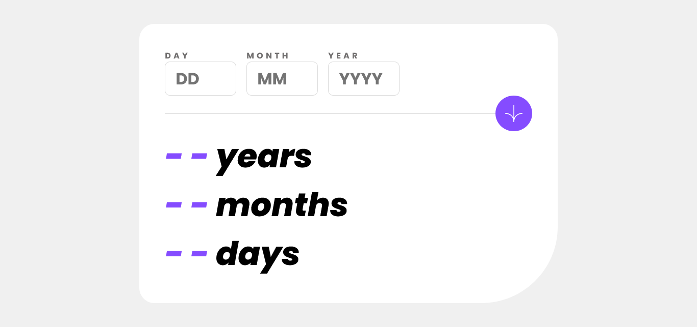

# Frontend Mentor - Age calculator app solution

This is a solution to the [Age calculator app challenge on Frontend Mentor](https://www.frontendmentor.io/challenges/age-calculator-app-dF9DFFpj-Q).

## Table of contents

- [Overview](#overview)
  - [The challenge](#the-challenge)
  - [Screenshot](#screenshot)
  - [Links](#links)
- [My process](#my-process)
  - [Built with](#built-with)
  - [What I learned](#what-i-learned)
  - [Continued development](#continued-development)
  - [Useful resources](#useful-resources)
- [Author](#author)

## Overview

### The challenge

Users should be able to:

- View an age in years, months, and days after submitting a valid date through the form
- Receive validation errors if:
  - Any field is empty when the form is submitted
  - The day number is not between 1-31
  - The month number is not between 1-12
  - The year is in the future
  - The date is invalid e.g. 31/04/1991 (there are 30 days in April)
- View the optimal layout for the interface depending on their device's screen size
- See hover and focus states for all interactive elements on the page
- **Bonus**: See the age numbers animate to their final number when the form is submitted

### Screenshot



### Links

- Live Site URL: [https://lucasepk.github.io/age-calculator-app/](https://lucasepk.github.io/age-calculator-app/)

## My process

### Built with

- Semantic HTML5 markup
- CSS
- JavaScript
- Flexbox
- CSS Grid
- Mobile-first workflow

### What I learned

About html I learnt about number input type.

About CSS I learnt about importing fonts when given with ttf files, how to remove default arrows of input number, gap works on flexbox too, using italic, setting border radius of only one corner, paint the text cursor and overall got a lot better with flexbox.

About JavaScript I learnt to get the current date, settimeout and setinterval, textcontent property, objects, addeventlistener property and synchronous delay
```js
function print_to_html(years, months, days) {
    //here we take the age as parameters and output it to the html with an animation 

    //this objects and the array are created to make code more compact
    let years_obj = {
        selector: ".js-age-years",
        value: years
    };

    let months_obj = {
        selector: ".js-age-months",
        value: months
    }
    
    let days_obj = {
        selector: ".js-age-days",
        value: days
    }
    let ages = [years_obj, months_obj, days_obj];

    let interval = 1000;

    ages.forEach(age => {
        //for each age parameter (years, months,days) we display the numbers going up in an animation till it reaches the proper number using setinterval function

        let i = 0;
        let duration = interval/age.value; //this makes the number complete in the interval time

        let counter_reset = false;

        let counter = setInterval(() => {
            
            document.querySelector(".arrow_icon").addEventListener("click", function() {//this is necessary to stop the animation once the submit button has been pressed
                counter_reset = true;
            })
            
            document.querySelector(age.selector).textContent = i; //textContent is similar to innerHtml
            
            if (i == age.value || counter_reset == true) {
                clearInterval(counter);
            }
            
            i += 1;
        }, duration);
    });


}
```

### Continued development

I would like to get more comfortable with JavaScript and get better at naming classes in the html.

### Useful resources

- [https://fedmentor.dev/posts/selectors-in-js/](https://fedmentor.dev/posts/selectors-in-js/) - This explains how to use classes to manipulate the DOM using JS
- [https://www.w3schools.com/html/html_form_input_types.asp](https://www.w3schools.com/html/html_form_input_types.asp) - explanation of input types, including number
- [https://www.w3schools.com/html/html_form_attributes.asp](https://www.w3schools.com/html/html_form_attributes.asp) - list of all useful attributes of html inputs
- [https://es.wikipedia.org/wiki/A%C3%B1o_bisiesto](https://es.wikipedia.org/wiki/A%C3%B1o_bisiesto) - explanation on how to calculate leap year, sorry if it's in spanish but the english wikipedia didn't have the explanation
- [https://www.scaler.com/topics/get-current-date-in-javascript/](https://www.scaler.com/topics/get-current-date-in-javascript/) - how to get current date with JavaScript
- [https://www.sitepoint.com/delay-sleep-pause-wait/](https://www.sitepoint.com/delay-sleep-pause-wait/) - what to use to set a delay
- [https://stackoverflow.com/questions/5226285/settimeout-in-for-loop-does-not-print-consecutive-values](https://stackoverflow.com/questions/5226285/settimeout-in-for-loop-does-not-print-consecutive-values) - explanation of how to use settimeout
- [https://www.youtube.com/watch?v=FaMW-CtExrs](https://www.youtube.com/watch?v=FaMW-CtExrs) - Really good youtube video on how to make number going up animation
- [https://developer.mozilla.org/en-US/docs/Web/API/Node/textContent](https://developer.mozilla.org/en-US/docs/Web/API/Node/textContent) - textcontent attribute explanation
- [https://www.w3schools.com/js/js_object_definition.asp](https://www.w3schools.com/js/js_object_definition.asp) - explanation of javascript objects
- [https://www.geeksforgeeks.org/how-to-include-a-font-ttf-using-css/](https://www.geeksforgeeks.org/how-to-include-a-font-ttf-using-css/) - explanation on how to use ttf fonts in css
- [https://stackoverflow.com/questions/28279989/multiple-font-weights-one-font-face-query](https://stackoverflow.com/questions/28279989/multiple-font-weights-one-font-face-query) - explanation of how to make multiple font weights and style with font face query
- [https://www.w3schools.com/howto/howto_css_hide_arrow_number.asp](https://www.w3schools.com/howto/howto_css_hide_arrow_number.asp) - how to remove default arrows from number input
- [https://www.geeksforgeeks.org/how-to-check-a-button-is-clicked-or-not-in-javascript/](https://www.geeksforgeeks.org/how-to-check-a-button-is-clicked-or-not-in-javascript/) - explanation of how to check if a button was clicked in javascript
- [https://blog.praveen.science/right-way-of-delaying-execution-synchronously-in-javascript-without-using-loops-or-timeouts/](https://blog.praveen.science/right-way-of-delaying-execution-synchronously-in-javascript-without-using-loops-or-timeouts/) - explanation of how to delay synchronously
- [https://stackoverflow.com/questions/6921895/synchronous-delay-in-code-execution](https://stackoverflow.com/questions/6921895/synchronous-delay-in-code-execution) - another explanation of how to delay synchronously

## Author

- Frontend Mentor - [@LucasEPK](https://www.frontendmentor.io/profile/LucasEPK)
